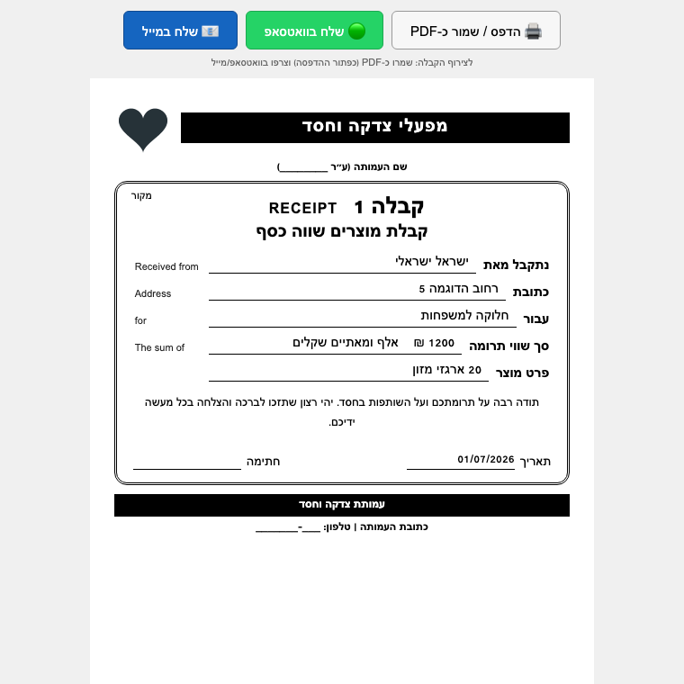

# Donation Receipts · קבלות תרומות

[](https://github.com/baruchyankovich/donation-receipts/actions/workflows/ci.yml)
[](LICENSE)

A small, **local & offline** desktop application that helps nonprofits record
and manage **in-kind (goods) donation receipts**, export them to Excel, back
them up, and print a receipt that can be saved as PDF.

Built with the Python standard library (Tkinter + SQLite) plus `openpyxl`, so
it runs as a single Windows executable with no server, no accounts and no
internet connection. The interface and receipts are in Hebrew.

> This is a generic, reusable version. Every organization sets its own name,
> address, logo and starting receipt number from the in-app **Settings** screen —
> no organization details are hard-coded.

<p align="center">
  
</p>

## Features

- 🧾 **Receipts** with automatic numbering and date.
- 👤 **Donor autocomplete** — start typing a name to reuse a returning donor's
  address, phone and email.
- 🔤 **Amount in words** — converts a shekel amount to correct Hebrew words.
- 🔎 **Search & date filters** (this month / this year / custom range) with a
  running total.
- 👥 **Donor history** and a printable **annual donation summary**.
- 📊 **Excel export** (all receipts or the current filtered view).
- ☁️ **Backup & restore** to any folder (point it at a synced Google
  Drive/OneDrive folder to back up to the cloud). Restore supports *merge* or
  *full replace*, with an automatic safety snapshot before replacing.
- 🟢📧 **Share** a receipt via WhatsApp or email with a pre-filled message.
- 🖼️ **Custom logo** — upload your organization's logo (default is a neutral
  placeholder).

## Architecture

The code separates pure logic from I/O and UI so the core is easy to test:

| Module | Responsibility |
| --- | --- |
| `receipts/hebrew_numbers.py` | Convert integers/amounts to Hebrew words (pure) |
| `receipts/formatting.py` | Parse/format amounts, dates, phones; HTML escaping (pure) |
| `receipts/models.py` | `Receipt` and `OrganizationSettings` dataclasses |
| `receipts/database.py` | SQLite persistence (parameterized queries, migrations) |
| `receipts/filters.py` | In-memory search / date filtering / totals |
| `receipts/backup.py` | Backup creation and merge/replace restore |
| `receipts/documents.py` | Injection-safe HTML for receipts & summaries |
| `receipts/excel_export.py` | Excel export (CSV fallback) |
| `receipts/system.py` | Cross-platform "open file/URL" (no shell) |
| `receipts/ui/` | Tkinter widgets, dialogs and the main window |

## Getting started

The app is **cross-platform** — it runs on Windows, macOS and Linux. Run it
directly from source, or download/build a packaged app per platform below.

### Run from source (any OS)

```bash
python -m pip install -r requirements.txt
python main.py
```

Requires Python 3.10+ (with Tkinter, which is bundled on Windows and macOS
python.org builds; on Linux install `python3-tk`).

### Build a Windows executable

Any Windows machine with Python installed:

```bat
pip install pyinstaller openpyxl
pyinstaller --onefile --windowed --name DonationReceipts main.py
```

The result is `dist/DonationReceipts.exe` — a standalone file that needs
nothing else installed. First launch may show *"Windows protected your PC"*
(the app is unsigned) → **More info → Run anyway**.

### Build a macOS app

On a Mac with Python installed:

```bash
pip install pyinstaller openpyxl
pyinstaller --windowed --name DonationReceipts main.py
```

The result is `dist/DonationReceipts.app`. Because the app is unsigned,
macOS Gatekeeper blocks it on first launch — open it once via
**right-click → Open** (or run `xattr -cr DonationReceipts.app`), and it opens
normally afterwards.

### Build in the cloud (no local toolchain)

Both platforms build automatically on GitHub Actions: push a `v*` tag or run
the **Build Windows executable** / **Build macOS app** workflow manually, then
download the artifact from the Actions run.

## Development

```bash
pip install -e ".[dev]"
ruff check .          # lint
ruff format .         # format
pytest                # run the test suite
```

## Data, privacy & security

- All data is stored locally in `Documents/DonationReceipts/receipts.db`;
  nothing is sent anywhere.
- SQL is fully parameterized; user input is never interpolated into queries.
- All user-provided text rendered into receipts is HTML-escaped, and share
  links are URL-encoded, to prevent injection.
- Files and URLs are opened via `subprocess` argument lists (no shell), so
  paths with spaces or special characters are safe.

## תרומה לעמותות (Hebrew)

התוכנה חינמית וקוד-פתוח, וכל עמותה יכולה להשתמש בה בחינם. היא פועלת **מקומית
על המחשב, ללא אינטרנט וללא הרשמה**. מגדירים את פרטי העמותה (שם, כתובת, טלפון,
לוגו ומספר קבלה התחלתי) פעם אחת במסך ההגדרות — אין שום פרט מובנה מראש.

להרצה מהירה על Windows: מורידים את הקובץ `DonationReceipts.exe` מעמוד
ה-Releases ומריצים בלחיצה כפולה (בהפעלה ראשונה ייתכן שיופיע חלון "Windows
protected your PC" ‏→ ‏*More info → Run anyway*, כי הקובץ אינו חתום דיגיטלית).

## Contributing

Issues and pull requests are welcome. Please run `ruff check`, `ruff format`
and `pytest` before submitting.

## License

[MIT](LICENSE) — free to use, modify and distribute.
